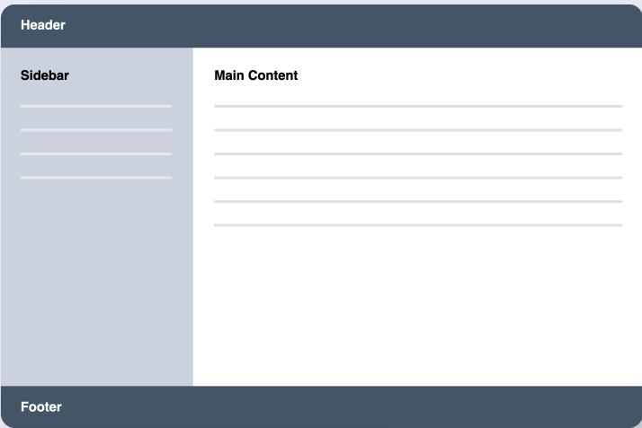

## Creating Columns in Grid (auto sizing):

The utilities `grid-cols-*` is used to specify how many columns you need on a web page with the size of each column.

`For Example`

`grid-cols-1`: creates one column with 100% width on a web page.
`grid-cols-2`: creates two columns with 50% width of each web page.
`grid-cols-3`: creates three columns with 33.34% width of each web page.

You can use utilities from `grid-cols-1` until
`grid-cols-12` (It means grid has maximum of 12 columns).

`For Example`:

Using `grid-cols-2` All the written content on a web page will fix into two columns.

## Creating columns in a web page (custom sizing)

        
----

The above code will split a web page into two columns one with 30% width while the other with the 70% width

`Note:` Using Above costom method you can create sidebar and the main page.

## Placement of content in columns (Custom palcement):

`Starting Postion of Contents`:

`col-start-1`: The content/items will be placed on the first available column on the web page.
`col-start-2`: The content/items will be placed on the second available column on the web page.

`Ending position of contents`:

`col-end-2`: It means that limiting the content till the `first column only`(end-2 means second column is not included).

`col-end-3`: It means that limiting the content till the `second column` (end-3 means third column is not included).

## Column Spaning

`cols-span-1`: This will spread your content into one column only
`cols-span-2`: This will spread your content starting from first and utill the second column.

Image is given below to understand the span concept.

In this Image `Join our community` para is span into two columns.
In the second image, The grid layout is with 2 columns and three rows. Header and footers are span across the two colunms.

Below is the code to achive the results same as pic:

  <header class="grid col-span-2">
    <h2>Header</h2>
  </header>
  

    <h2>Sidebar</h2>
  

  

    <h2>Main Content</h2>
  

  <footer class="grid col-span-2">
    <h2>.....</h2>
  </footer>

